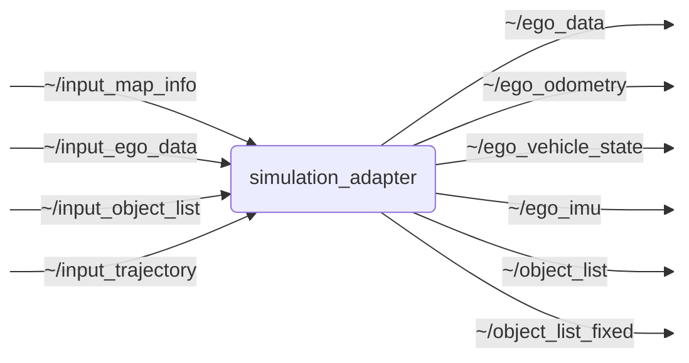

# `simulation_adapter`

Adapts OpenADSim data to OpenADStack-compatible ROS 2 interfaces

## Nodes

### `simulation_adapter`

#### Subscribed Topics

| Topic | Type | Description |
| --- | --- | --- |
| `~/input_map_info` | `std_msgs/msg/String` | Input topic for simulation map info |
| `~/input_ego_data` | `perception_msgs/msg/EgoData` | Input topic for simulation ego data |
| `~/input_object_list` | `perception_msgs/msg/ObjectList` | Input topic for simulation object lists |
| `~/input_trajectory` | `trajectory_planning_msgs/msg/Trajectory` | Input topic for planned trajectories |

#### Published Topics

| Topic | Type | Description |
| --- | --- | --- |
| `~/ego_data` | `perception_msgs/msg/EgoData` | Output topic for transformed ego data |
| `~/ego_odometry` | `nav_msgs/msg/Odometry` | Output topic for ego odometry |
| `~/ego_vehicle_state` | `perception_msgs/msg/ObjectState` | Output topic for ego vehicle state |
| `~/ego_imu` | `sensor_msgs/msg/Imu` | Output topic for ego IMU data |
| `~/object_list` | `perception_msgs/msg/ObjectList` | Output topic for transformed object lists |
| `~/object_list_fixed` | `perception_msgs/msg/ObjectList` | Output topic for object lists in the fixed frame |

#### Parameters

| Parameter | Type | Default | Description |
| --- | --- | --- | --- |
| `map_server_name` | `string` | `"/ll2_map_server"` | Name of the map server. |
| `load_lanelet_map` | `bool` | `true` | Automatically set the ll2 map based on the simulation map. |
| `simulation_fixed_frame_id` | `string` | `"simulation_map"` | Name of the fixed frame id in simulation. |
| `fixed_frame_id` | `string` | `"map"` | Name of the fixed frame id over time. |
| `simulation_vehicle_frame_id` | `string` | `"ego_vehicle"` | Name of the vehicle frame id in simulation. |
| `vehicle_frame_id` | `string` | `"geo_center"` | Name of the vehicle frame id. |
| `publish_vehicle_frame_tf` | `bool` | `true` | Whether to publish the static TF from simulation_vehicle_frame_id to vehicle_frame_id. |
| `publish_ego_odometry` | `bool` | `false` | Whether to publish ego odometry. |
| `publish_ego_vehicle_state` | `bool` | `false` | Whether to publish the ego vehicle state. |
| `publish_ego_imu` | `bool` | `false` | Whether to publish the ego IMU. |
| `simulation_vehicle_frame_id_to_vehicle_frame_id` | `float` | `0.0` | Longitudinal offset from simulation_vehicle_frame_id to vehicle_frame_id. |
| `maps.simulation_maps` | `string[]` | `[]` | List of supported simulation maps. |
| `maps.lanelet_files` | `string[]` | `[]` | Lanelet files for all supported simulation maps |
| `num_threads` | `int` | `1` | number of threads for MultiThreadedExecutor |

## Launch Files

### [`simulation_adapter.launch.py`](launch/simulation_adapter.launch.py)

| Argument | Default | Description |
| --- | --- | --- |
| `input_map_info_topic` | `"~/input_map_info"` | Input topic for simulation map info |
| `input_ego_data_topic` | `"~/input_ego_data"` | Input topic for simulation ego data |
| `input_object_list_topic` | `"~/input_object_list"` | Input topic for simulation object lists |
| `input_trajectory_topic` | `"~/input_trajectory"` | Input topic for planned trajectories |
| `output_ego_data_topic` | `"~/ego_data"` | Output topic for transformed ego data |
| `output_object_list_topic` | `"~/object_list"` | Output topic for transformed object lists |
| `output_object_list_fixed_topic` | `"~/object_list_fixed"` | Output topic for object lists in the fixed frame |
| `output_ego_imu_topic` | `"~/ego_imu"` | Output topic for ego IMU data |
| `output_ego_odometry_topic` | `"~/ego_odometry"` | Output topic for ego odometry |
| `output_ego_vehicle_state_topic` | `"~/ego_vehicle_state"` | Output topic for ego vehicle state |
| `name` | `"simulation_adapter"` | Node name |
| `namespace` | `""` | Node namespace |
| `params` | `os.path.join(get_package_share_directory("simulation_adapter"), "config", "params.yml")` | Path to parameter file |
| `log_level` | `"info"` | ROS logging level (debug, info, warn, error, fatal) |
| `use_sim_time` | `"true"` | Use simulation clock |
| `load_lanelet_map` | `"true"` | Automatically set lanelet2 map from simulation map info |
